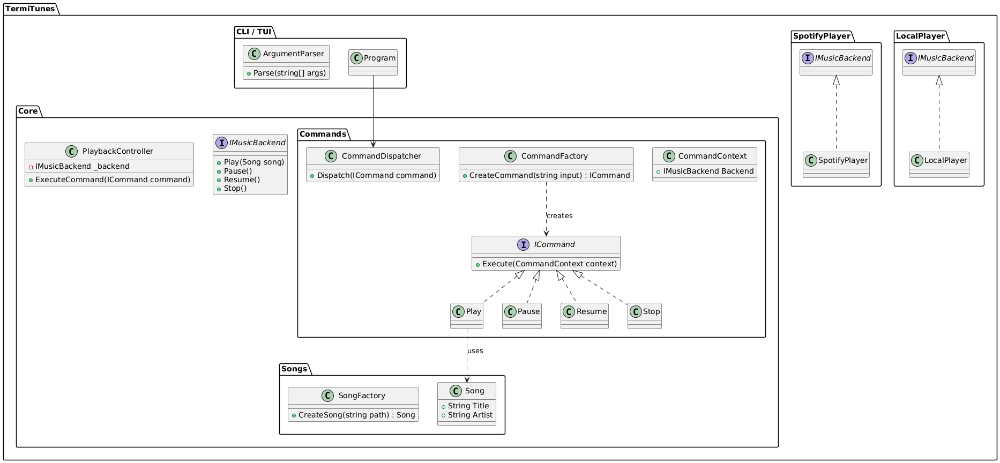

# Termi Tunes

TermiTunes is a Spotify CLI that with nice features, that I'm sure, will be added in the future.

## TODO

- [x] implement logic behind the local player
- [ ] build the terminal cli
- [ ] implement the Spotify player
- [ ] build the terminal app
- [ ] implement themes

## Details

### Class Diagram for Core Logic



### CLI

#### Logic

When a song is saved to a playlist it gets a autogenerated tag for example the song **"Call Me"** by **"Blondie"**
becomes **"call_me"**.
If a song with this shortcut already exists then the artist name is added at the end so for example the song **"Call Me"
** by **"Troy"** becomes **"call_me_troy"**.
These can be changed anytime by simmply executing **termi change_nick call_me call_me_blondie**.

If you want to play a song that isnt saved in a playlist at the moment, you'll first need to **search** the song and
then **select** the fitting search result, it will then be added to a playlist called **"Recents"** from where you can 
add it to other playlist by exicuting **add call_me "Old Bangers"**.

You can let the lyrics be displayed by excicuting **lyr**, then you can change the theme of those lyrics and the whole
CLI and TUI with **ctheme blue** or list all themes with **ltheme** and then select the one you want with the number
keys.

If you want to change the device youre playing on, you have to excecute **spotify**, this will switch you to spotify
only mode where you'll be able to pick your device with **cdevice "Pendelins Fire TV Cube"** or just use **ldevice** to
list all and then selcet the one you want with the number keys.

#### Ussage

```
commands: 
    playback:
        play        - plays song or playlist
            -shuffle / -s
            -smart_shuffle / -ss
            -no_shuffle / -ns
            -loop / -l
        pause       - pauses current song
        resume      - resume current song
        lyr         - display lyrics in current theme
            -a      - print all lyrics
    qeueu:
        queue       - add to qeueu
        skip        - playes next in qeueu
        back        - playes last played
    management:
        search      - search a song
            -f      - play first result
        cnick       - change nickname of a song
        add         - adds song to playlist
    playlists:
        c           - go into a playlist
        l           - lists all playlists (select with number keys)
    appereance theme:
        ltheme      - list all themes (select with number keys)
        ctheme      - change theme
        
// maybe required 
    spotify-only mode:
        spotify     - switch to spotify only mode
        cdevice     - change devices
        ldevice     - list all available devices (select with number keys)

example:
    play #1 -ss             - plays the playlist number 1 with smart shuffling
    play call_me            - plays "Call me" from a playlist (auto complete songs)
    search -f "call me"     - searches for the term and plays first result
```